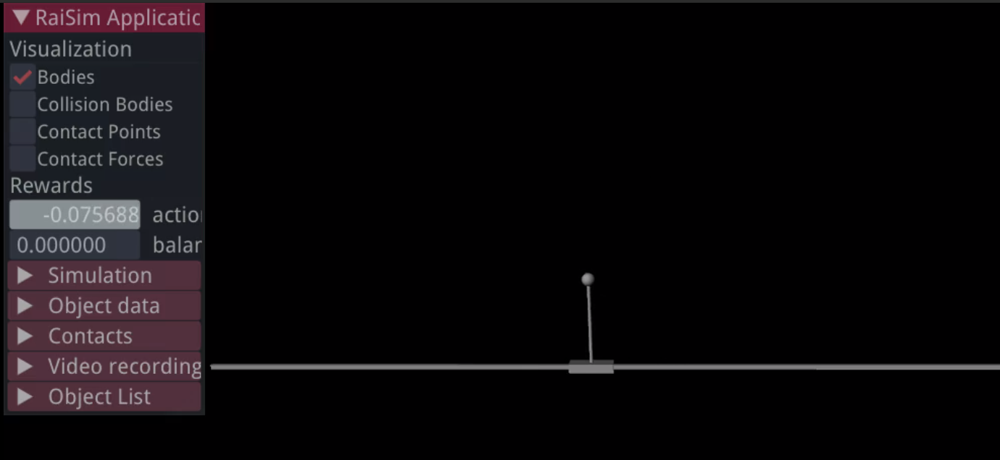
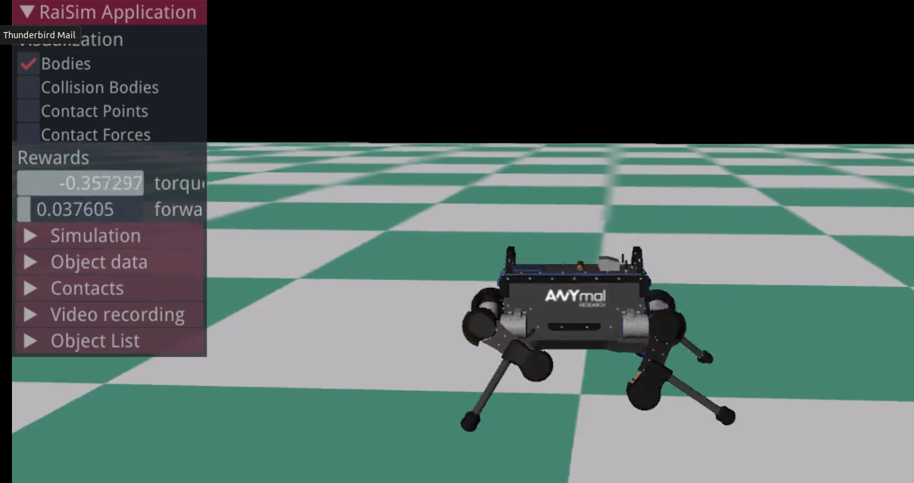
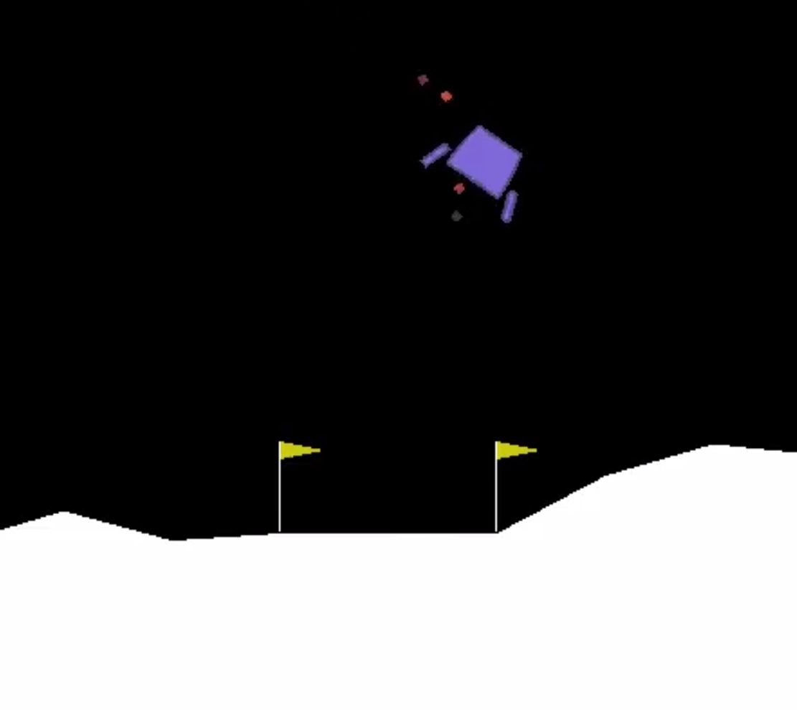

Examples
=========

We provide examples for training RL agents that are simulated in RaiSim and the openAI Gym.

The examples are located in rslgym/examples/envs.

To run the examples that use PFRL algorithms install PFRL in your virtual environment::

    pip3 install pfrl

To run the openAI box2D examples install box2D::

  pip3 install box2d-py box2d-kengz

RaiSim Cart Pole
^^^^^^^^^^^^^^^^^

Simple cart pole balancing example using RaiSim.

With the provided hyperparameters the agent is able to balance the pole. However, the performance can always be improved with more tuning. Feel free to contribute if you find better settings.

1.  Activate your virtual python environment::

      workon <name-of-rslgym-virtualenv>

2.  Build the cart pole environment. Inside **rslgym/examples/envs/cart_pole** run::

      rslgym build . --name cart_pole --CMAKE_PREFIX_PATH $LOCAL_INSTALL

3.  Train the cart pole agent running the **\*\_train.py** scrips in cart_pole/scripts.

  The scripts regularly test the current performance of the agent and store the weights of the neural networks and a video in **cart_pole/runs/<time_and_data_when_training_started>**.

  The training configuration and hyperparameters can be configured in the **cfg.yaml** file::

      ./rsl_ppo_train.py --cfg_name=<optional-path-to-cfg-default:cfg.yaml>

4.  The learning progress can be monitored using **tensorboard**. In another terminal, activate your virtual environment and run::

      tensorboard --logdir=<absolute-path-to-folder-containing-training-weights>

5.  The performance of the agent can also be tested using the **\*\_test.py** scripts. Videos of the tests are stored in the folder where the policy weights are stored. In the folder **testing_<tested_iteration>**::

      ./rsl_ppo_test.py --weight <path_to_folder_with_weights> -i <iteration_to_test>

RaiSim ANYmal Bear
^^^^^^^^^^^^^^^^^^^

Simple locomotion example with ANYmal Bear in RaiSim.

To train the agent, follow the same steps as in the cart_pole example above. Build the environment with the name **anymal**::

    rslgym build . --name anymal --CMAKE_PREFIX_PATH $LOCAL_INSTALL

OpenAI Gym
^^^^^^^^^^^^

Example of training openAI gym environments with PPO.

No need to compile anything. Just run the training scripts in your virtual environment.
